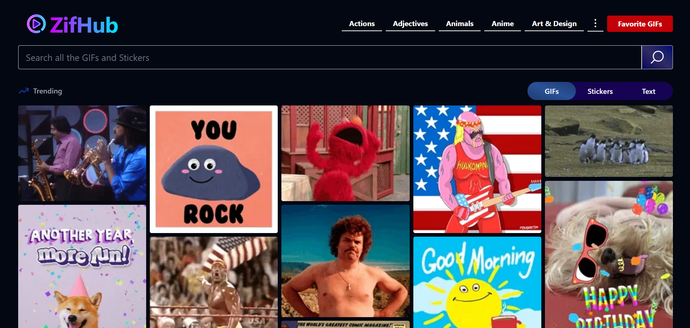

# ZifHub 🎬✨

A modern Giphy-style GIF-sharing platform built with **React**, **Tailwind CSS**, and **React Router**. GifHub allows users to explore, search, and share looping GIFs in a sleek, dark-themed interface.

---

## 🚀 Features

- 🔍 Search trending and popular GIFs  
- 🎥 View looping GIFs with smooth previews  
- 🌓 Dark mode friendly UI (Tailwind-powered)  
- 🔁 Infinite scroll / paginated GIF loading  
- ❤️ Like or Save your favorite GIFs *(optional feature)*  
- ⚙️ Built using React + React Router DOM  

---

## 🛠 Tech Stack

- [React](https://reactjs.org/)
- [React Router](https://reactrouter.com/)
- [Tailwind CSS](https://tailwindcss.com/)
- [Giphy API](https://developers.giphy.com/) *(or any GIF API you use)*

## 📦 Setup Instructions

```bash
# Clone the repo
git clone https://github.com/Eswarchinthakayala-webdesign/ZifHub.git
cd ZifHub

# Install dependencies
npm install

# Start the dev server
npm run dev
```

---

## 🌐 Live Demo

>  [Link](https://zifhub.vercel.app/))

---

## 📸 Preview



---

## 📄 License

MIT © [Eswar Chinthakayala](https://github.com/Eswarchinthakayala-webdesign)

---

## 🙌 Contributions

Pull requests welcome! For major changes, please open an issue first to discuss.
